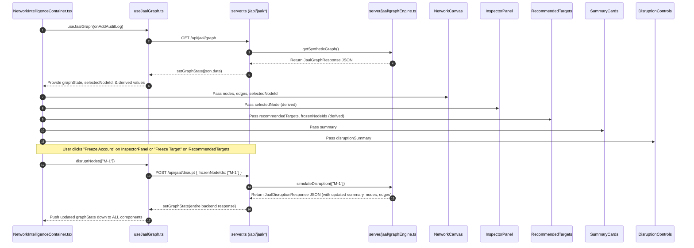

# JAAL Architecture Specification

- **Purpose**: Describes overall system architecture, data flow, folder structure, component relationships, and SafeNet integration for the JAAL Fraud Network Graph Intelligence module.
- **Last Updated**: 2026-07-21
- **Related Files**: `server.ts`, `server/jaal/graphEngine.ts`, `src/components/network-intelligence/*`, `src/types/jaal.ts`
- **Maintainer**: SafeNet Engineering Team (JAAL Lead)

---

## 1. System Overview

JAAL (Fraud Network Graph Intelligence) is an AI-assisted digital public safety engine designed to convert disconnected fraud reports (UPI handles, phone numbers, mule accounts, device IMEIs) into an actionable criminal network topology graph. It identifies fraud rings, calculates entity risk scores, prioritizes high-impact targets for law enforcement intervention, and simulates network disruption in real time.

---

## 2. Refactored Single Source of Truth Architecture

State management is centralized inside **`useJaalGraph`** using a single `graphState` object:

```typescript
export interface JaalGraphState {
  summary: JaalSummary | null;
  nodes: JaalNode[];
  edges: JaalEdge[];
  fraudRings: JaalFraudRing[];
  recommendedTargets: JaalRecommendedTarget[];
  disruptionSummary: JaalDisruptionSummary | null;
}
```

### Architectural Guarantees:
1. **Single Source of Truth**: Backend API responses (`GET /api/jaal/graph` and `POST /api/jaal/disrupt`) completely replace `graphState`.
2. **Selected Node ID**: Only string ID (`selectedNodeId: string | null`) is stored in React state. The `selectedNode` object reference is dynamically derived: `graphState.nodes.find(n => n.id === selectedNodeId)`.
3. **No Duplicated Frozen State**: Frozen node IDs are dynamically derived directly from `graphState.nodes.filter(n => n.isFrozen).map(n => n.id)`.

---

## 3. Data Flow Diagram


